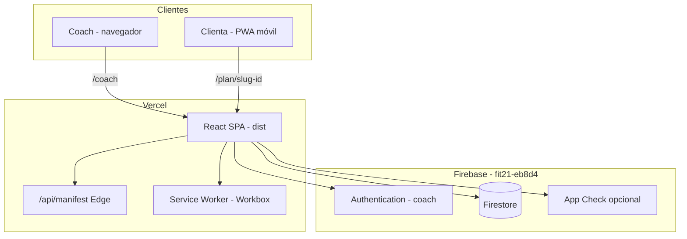
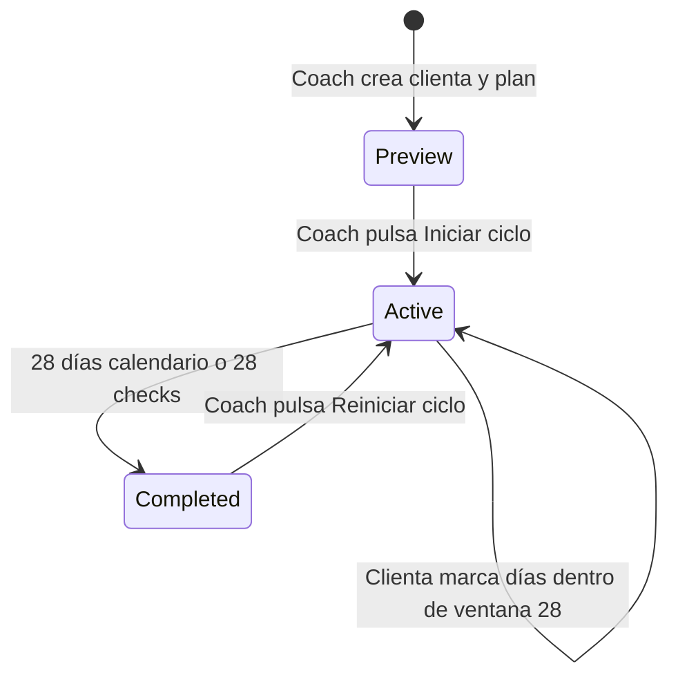
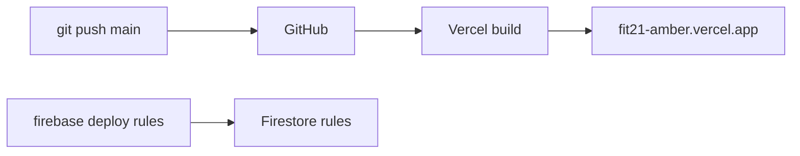

# Arquitectura e implementación — FIT21

Descripción de la arquitectura **actual**, el stack, el modelo de datos, el despliegue y cómo **escalar** en el futuro cercano.

---

## 1. Vista general



### Principios de diseño

1. **Sin backend propio** — toda la lógica de datos vive en Firestore + rules; Vercel sirve estáticos y un endpoint de manifest.
2. **Clienta anónima** — acceso por link con `clientId` en la URL; sin cuenta Firebase.
3. **Coach autenticado** — Firebase Auth (email/password) + allowlist en rules y `.env`.
4. **Tiempo real** — `onSnapshot` para planes, progreso y notificaciones.
5. **PWA first** — instalación sin tienda; manifest dinámico por plan.

---

## 2. Stack tecnológico

| Capa | Tecnología | Versión / notas |
|------|------------|-----------------|
| UI | React | 19.x |
| Build | Vite | 8.x |
| Lenguaje | TypeScript | 6.x |
| Routing | React Router | 7.x |
| Estilos | CSS modular por componente | Variables CSS FIT21 |
| Datos | Firebase Firestore | SDK 12.x |
| Auth | Firebase Authentication | Solo coach |
| PWA | vite-plugin-pwa + Workbox | autoUpdate |
| Manifest dinámico | Vercel Edge (`api/manifest.ts`) | `start_url` por plan |
| Hosting | Vercel | SPA rewrite + API |
| Tests | Vitest | 31 tests |
| Lint | oxlint | — |
| IDs | nanoid | 10 chars por clienta |

---

## 3. Rutas y responsabilidades

| Ruta | Componente principal | Quién |
|------|---------------------|-------|
| `/` | `App.tsx` → `Home` | Público; banner “Continuar mi plan” |
| `/coach` | `CoachDashboard` | Coach |
| `/coach/client/:id` | `CoachClientEdit` | Coach |
| `/coach/biblioteca` | `ExerciseLibrary` | Coach |
| `/plan/:clientId` | `ClientPlan` | Clienta (slug-id o id crudo) |
| `/api/manifest` | `api/manifest.ts` | PWA (Edge) |

**Router:** [`src/App.tsx`](../src/App.tsx)

---

## 4. Modelo de datos (Firestore)

### Colecciones principales

```
clients/{clientId}
  name, slug?, createdAt, cycleStartedAt?, coachMeta?

routines/{clientId}_{0..6}
  exercises[], dayName, level, classification, comment, createdAt, updatedAt

nutrition/{clientId}_{0..6}  (+ legacy nutrition/{clientId})
  meals[], dayName, calories?, ...

weekProgress/{clientId}_{weekStartMonday}
  "YYYY-MM-DD": boolean

progressCount/{clientId}
  count: 0..28

clientNotifications/{clientId}
  messages[], lastReadAt?

feedback/{autoId}
  clientId, rating, comment, createdAt

library-exercises/{id}
  name, mediaUrl, muscleGroup

routineHistory / nutritionHistory
  snapshots en cada guardado coach
```

### Ciclo de 28 días (estado)



- **`cycleStartedAt`**: solo lo escribe el coach (`startClientCycle` / `restartClientCycle`).
- **`progressCount`**: incrementa solo si la fecha está dentro de los 28 días del ciclo.
- **Preview**: clienta ve rutina/nutrición; sin checkbox ni contador.

Lógica central: [`src/lib/firestore.ts`](../src/lib/firestore.ts)

---

## 5. Seguridad

Resumen; detalle en [SECURITY.md](../SECURITY.md).

| Actor | Lectura | Escritura |
|-------|---------|-----------|
| Anónimo (clienta) | `get` de su plan, rutinas, nutrición, notificaciones | `weekProgress` (1 día), `progressCount` (+/-1), `feedback`, `lastReadAt` |
| Coach (Auth + allowlist) | `list` de colecciones, todo lo operativo | CRUD clientas, planes, notificaciones, ciclo |
| Público | `get` clients (para validar link) | — |

**Capas adicionales:**

- `VITE_COACH_EMAILS` + `coachEmails()` en rules
- Allowlist de hosts en `mediaUrl.ts` (GIFs Drive, etc.)
- App Check opcional (reCAPTCHA v3)

---

## 6. PWA e instalación

### Android

- Chrome → “Instalar app” o link pegado en barra de direcciones
- Manifest apunta a `/api/manifest?start=/plan/...`

### iOS

- **Safari obligatorio** (Chrome no instala)
- “Agregar a pantalla de inicio”
- `applyManifestForCurrentPath()` en `main.tsx` antes de React
- Pointer `fit21_last_client_id` en `localStorage` como red de seguridad

Archivos clave:

- [`src/lib/clientPlanStorage.ts`](../src/lib/clientPlanStorage.ts)
- [`api/manifest.ts`](../api/manifest.ts)
- [`src/lib/installHint.ts`](../src/lib/installHint.ts)

---

## 7. Despliegue



### Comandos

```bash
# App (automático en push a main)
git push origin main

# Rules (manual cuando cambien permisos)
npm run deploy:rules

# Tests locales
npm test
npm run build
```

### Variables de entorno (Vercel + `.env`)

Ver [`.env.example`](../.env.example): `VITE_FIREBASE_*`, `VITE_COACH_EMAILS`, `VITE_RECAPTCHA_SITE_KEY`.

---

## 8. Escalamiento en el futuro cercano

### Fase A — Más clientas, mismo modelo (0–50 coaches / 500 clientas)

**Qué aguanta hoy:**

- Firestore escala bien para lecturas por documento
- Links personales sin login
- PWA sin tienda

**Ajustes recomendados:**

| Necesidad | Acción |
|-----------|--------|
| Costos Firestore | Índices compuestos si aparecen queries lentas; evitar `list` masivo en cliente |
| Anti-trampa progreso | Cloud Function Callable para `progressCount` |
| Soporte | Política de privacidad + página de ayuda pública |
| Onboarding | Infografía instalación (ya en diseño) |

### Fase B — Play Store (TWA)

- Empaquetar PWA con **Bubblewrap / PWABuilder**
- `/.well-known/assetlinks.json` en Vercel
- App solo **clienta**; coach sigue en web
- Mismo backend Firebase

### Fase C — SaaS multi-coach

| Cambio | Impacto |
|--------|---------|
| `organizationId` en `clients` | Rules por tenant |
| Login clienta opcional (magic link) | Menos fricción que links manuales |
| Subdominios `coach.fit21.app` | Branding por coach |
| Stripe / billing | Fuera del MVP actual |

### Fase D — Apple App Store

- **Capacitor** sobre `dist/` (no TWA)
- Cuenta Apple Developer ($99/año)
- Misma API Firebase

### Qué **no** haría todavía

- Reescribir en React Native
- Backend Node separado (salvo Functions puntuales)
- Base de datos distinta de Firebase

---

## 9. Pruebas realizadas

### Automatizadas (Vitest) — 31 tests

| Archivo | Qué valida |
|---------|------------|
| `src/lib/dates.test.ts` | Días de semana, ciclo, `isDateWithinCycle` |
| `src/lib/clientSlug.test.ts` | Slugs y parseo de URL `/plan/wendy-id` |
| `src/lib/planContent.test.ts` | Detección de rutina/nutrición con contenido |
| `src/lib/mediaUrl.test.ts` | Normalización Google Drive → thumbnail |
| `src/types/helpers.test.ts` | `initials`, helpers de UI |
| `api/manifest.test.ts` | Sanitización de `start_url` |

```bash
npm test        # una vez
npm run test:watch
```

### Manuales (realizadas en desarrollo)

| Área | Dispositivos / notas |
|------|---------------------|
| Coach dashboard | Mac, Chrome |
| Vista clienta | Android Samsung/Oppo (Chrome) — OK |
| PWA Android | Instalación y reapertura con plan personalizado — OK |
| PWA iOS | Safari; fix manifest jul 2026 — pendiente re-test físico |
| Seguridad rules | Mac con coach logueado |
| Ciclo coach-iniciado | Lógica preview / iniciar / reiniciar |
| Feedback y notificaciones | Flujo coach → clienta |

### Pruebas recomendadas antes de escalar

- [ ] iPhone: instalar desde Safari tras deploy `0761371`
- [ ] Reiniciar ciclo Wendy el lunes (caso real Claudia)
- [ ] Clienta sin Chrome: copiar link → pegar en Chrome (Android)
- [ ] Lighthouse PWA audit
- [ ] Rules: intento de write anónimo malicioso (progressCount +10)

---

## 10. Diagrama de componentes (frontend)

```
src/
├── App.tsx              # Router: Home, CoachLayout, ClientPlan
├── main.tsx             # Manifest temprano para iOS
├── pages/
│   ├── CoachDashboard   # Lista clientas, overview, feedback
│   ├── CoachClientEdit  # Editor rutina + nutrición por día
│   ├── ClientPlan       # Vista clienta completa
│   └── ExerciseLibrary  # Catálogo GIFs
├── components/          # UI reutilizable (pips, chart, help, …)
├── lib/
│   ├── firestore.ts     # ★ Capa de datos (lectura/escritura)
│   ├── dates.ts         # ★ Calendario y ciclo
│   ├── clientSlug.ts    # URLs amigables
│   ├── clientPlanStorage.ts  # PWA pointer + manifest link
│   └── firebase.ts      # Init SDK + App Check
└── types/index.ts       # Tipos + constantes CYCLE_DAYS
```

La capa **`firestore.ts`** concentra la mayor parte de la lógica de negocio del lado cliente.

---

## 11. Referencias externas

- [Firebase Firestore Security Rules](https://firebase.google.com/docs/firestore/security/get-started)
- [Vite PWA plugin](https://vite-pwa-org.netlify.app/)
- [PWABuilder](https://www.pwabuilder.com/) — futuro Play Store TWA
- [MDN Web App Manifest](https://developer.mozilla.org/en-US/docs/Web/Manifest)
