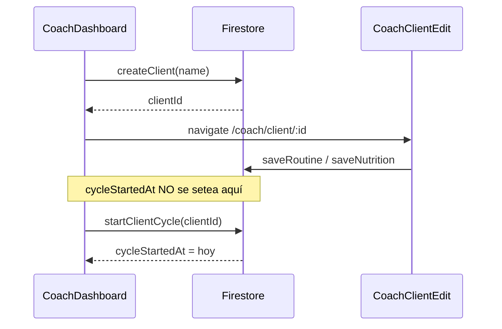
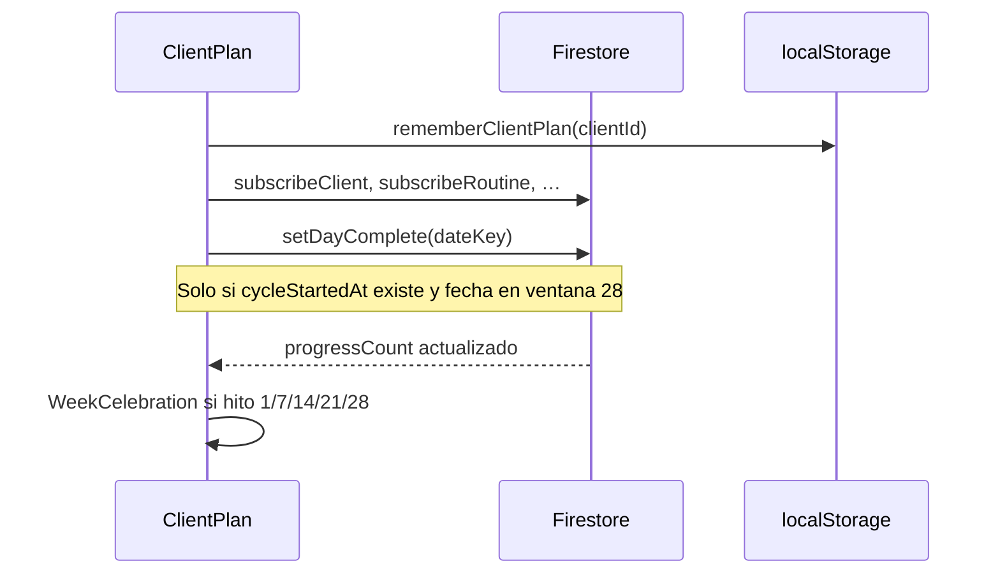

# Guía del código — FIT21

Cómo **orientarse** en el repositorio, seguir un flujo de punta a punta y saber dónde tocar para cada tipo de cambio.

---

## 1. Arranque rápido para desarrolladores

```bash
cd fit21
cp .env.example .env    # completar VITE_FIREBASE_*
npm install
npm run dev             # http://localhost:5173
```

En otra terminal, cuando cambies rules:

```bash
npm run deploy:rules
```

**URLs locales:**

- Coach: http://localhost:5173/coach
- Clienta de prueba: http://localhost:5173/plan/{id} (crear clienta en coach primero)

---

## 2. Mapa mental del repositorio

```
fit21/
├── api/                    # Vercel Edge (manifest PWA)
├── docs/                   # Esta documentación
├── public/                 # Assets estáticos (logo, favicon)
├── src/
│   ├── App.tsx             # Rutas principales
│   ├── pages/              # Pantallas completas
│   ├── components/         # Piezas de UI
│   ├── lib/                # Lógica y datos ★
│   └── types/              # Tipos TypeScript compartidos
├── firestore.rules         # Seguridad backend ★
├── vercel.json             # Rewrites SPA + API
├── vite.config.ts          # Build, PWA, dev manifest
├── SECURITY.md             # Ops seguridad
└── README.md               # Setup corto
```

**Regla práctica:** si el cambio es de **negocio o datos**, empieza en `firestore.ts` o `firestore.rules`. Si es **UI**, en `pages/` o `components/`.

---

## 3. Flujos de punta a punta

### 3.1 Coach crea clienta y asigna plan



Archivos: `CoachDashboard.tsx`, `CoachClientEdit.tsx`, `firestore.ts` (`createClient`, `saveRoutine`, `startClientCycle`)

---

### 3.2 Clienta abre link y marca día



Archivos: `ClientPlan.tsx`, `firestore.ts` (`setDayComplete`, `incrementProgressCount`)

---

### 3.3 Coach ve avance en dashboard

`CoachDashboard` suscribe `subscribeClientCoachOverview` por clienta, que agrega:

- `progressCount`, `cycleDay`, `dailyCompletion`
- `activeRoutineDays` (días con ejercicios)
- metas de `coachMeta`

Archivos: `CoachDashboard.tsx`, `ClientOverviewPanel.tsx`, `CoachProgressChart.tsx`, `firestore.ts` (`subscribeClientCoachOverview`, `buildDailyCompletion`)

---

### 3.4 PWA: manifest por plan

1. `main.tsx` → `applyManifestForCurrentPath()` si URL es `/plan/...`
2. `rememberClientPlan()` actualiza `<link rel="manifest" href="/api/manifest?start=...">`
3. Vercel Edge sirve JSON con `start_url` correcto

Archivos: `main.tsx`, `clientPlanStorage.ts`, `api/manifest.ts`, `vite.config.ts` (dev middleware)

---

## 4. Archivos “si tocas X, mira Y”

| Quiero cambiar… | Archivo(s) |
|-----------------|------------|
| Colores / tipografía global | `src/App.css`, variables en CSS de componentes |
| Rutas | `src/App.tsx` |
| Login coach | `CoachAuthGate.tsx`, `coachAllowlist.ts` |
| Lista de clientas | `CoachDashboard.tsx` |
| Editor rutina/nutrición | `CoachClientEdit.tsx` |
| Vista clienta | `ClientPlan.tsx`, `ClientPlan.css` |
| Checkbox “completé rutina” | `ClientPlan.tsx` → `setDayComplete` |
| Inicio / reinicio de ciclo | `firestore.ts`, `ClientOverviewPanel.tsx`, `firestore.rules` |
| Celebraciones | `WeekCelebration.tsx`, `CELEBRATION_MILESTONES` en `types/index.ts` |
| Ayuda ? | `ClientHelpSheet.tsx` |
| Hints instalación PWA | `installHint.ts`, `InstallHint.tsx` |
| Slug en URL | `clientSlug.ts` |
| Fechas / día de semana | `dates.ts` |
| GIFs de Google Drive | `mediaUrl.ts`, `MediaPlayer.tsx` |
| Permisos Firestore | `firestore.rules` → deploy |
| Manifest iOS/Android | `api/manifest.ts`, `vite.config.ts`, `clientPlanStorage.ts` |
| Tests de lógica pura | `src/lib/*.test.ts`, `api/manifest.test.ts` |

---

## 5. Capa de datos (`firestore.ts`)

Funciones exportadas más usadas:

| Función | Uso |
|---------|-----|
| `subscribeClients` | Dashboard coach |
| `createClient` / `updateClientName` / `deleteClient` | CRUD clientas |
| `saveRoutine` / `saveNutrition` | Editor coach |
| `subscribeRoutine` / `subscribeNutrition` | Vista clienta y editor |
| `setDayComplete` | Checkbox clienta |
| `startClientCycle` / `restartClientCycle` | Control de ciclo (coach) |
| `subscribeClientCoachOverview` | Panel avance en dashboard |
| `updateClientCoachMeta` | Metas rutina/nutrición/kcal |
| `subscribeClientNotifications` | Campana clienta |

**Patrón:** lecturas con `onSnapshot`; escrituras con `setDoc` / `deleteDoc`. No hay REST API propia.

---

## 6. Tipos importantes (`types/index.ts`)

```typescript
CYCLE_DAYS = 28
CELEBRATION_MILESTONES = [1, 7, 14, 21, 28]

Client          // cycleStartedAt?, coachMeta?
ClientCoachOverview  // agregado para dashboard
Routine / NutritionPlan / Exercise
WeekProgress    // mapa fecha → boolean
```

---

## 7. Convenciones del proyecto

1. **IDs de documento:** `{clientId}_{dayIndex}` para rutinas y nutrición (0 = lunes … 6 = domingo).
2. **weekProgress docId:** `{clientId}_{mondayYYYY-MM-DD}`.
3. **Slug en URL:** `wendy-h9cNgFsHl8` → `parseClientPlanParam` extrae `h9cNgFsHl8`.
4. **CSS:** un `.css` por componente principal; prefijo BEM-like (`client-plan__`, `coach-`).
5. **Commits:** mensajes en español, imperativo, foco en el “por qué”.
6. **Sin login clienta:** nunca asumir `auth.currentUser` en `ClientPlan`.

---

## 8. Cómo ejecutar y verificar cambios

```bash
# Tests
npm test

# Build de producción (incluye PWA + strip start_url)
npm run build

# Preview local del build
npm run preview

# Lint
npm run lint
```

**Checklist antes de merge a `main`:**

1. `npm test` y `npm run build` pasan
2. Si tocaste `firestore.rules` → `npm run deploy:rules`
3. Probar flujo coach + clienta en local
4. Si tocaste PWA → verificar `/api/manifest?start=/plan/test-id` en preview

---

## 9. Debugging frecuente

| Problema | Dónde mirar |
|----------|-------------|
| “Permission denied” en clienta | `firestore.rules`, ¿existe `cycleStartedAt`? |
| Coach no entra | `VITE_COACH_EMAILS`, `coachEmails()`, usuario en Firebase Auth |
| Avance no coincide coach/clienta | `buildDailyCompletion`, `cycleStartedAt`, `weekProgress` |
| iOS abre landing | manifest: `api/manifest.ts`, icono viejo en home screen |
| GIF no carga | `mediaUrl.ts` allowlist, URL de Drive |
| Celebración no aparece | `CELEBRATION_MILESTONES`, key `fit21_celebrated_*` en localStorage |

**Firebase Console útil:**

- Firestore → `clients`, `weekProgress`, `progressCount`
- Authentication → usuarios coach
- App Check → tokens (si habilitado)

---

## 10. Lectura sugerida (orden)

Para un desarrollador nuevo en el proyecto:

1. [README.md](../README.md) — 10 min
2. [DISCOVERY.md](./DISCOVERY.md) — contexto de producto — 15 min
3. `src/App.tsx` + `src/types/index.ts` — 10 min
4. `src/lib/firestore.ts` (skim funciones exportadas) — 30 min
5. `src/pages/ClientPlan.tsx` — flujo clienta — 20 min
6. `src/pages/CoachDashboard.tsx` + `CoachClientEdit.tsx` — 30 min
7. `firestore.rules` — 20 min
8. [ARCHITECTURE.md](./ARCHITECTURE.md) — escalamiento — 15 min

**Total orientativo:** ~2.5 h para entender el sistema de punta a punta.

---

## 11. Contribuir sin romper producción

1. **No** commitear `.env` ni credenciales.
2. **No** relajar rules “temporalmente” en producción.
3. Cambios de ciclo/progreso → actualizar tests en `dates.test.ts` si aplica.
4. Cambios de URL/slug → actualizar `clientSlug.test.ts`.
5. UI clienta: probar en viewport móvil (375px).
6. Solo el usuario pide commits; ver reglas en conversación / `user_rules`.
