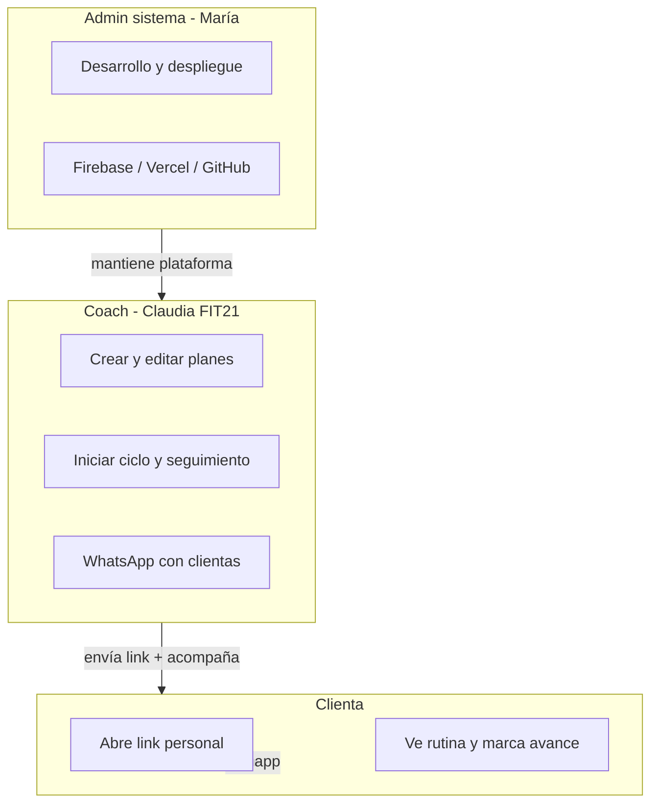
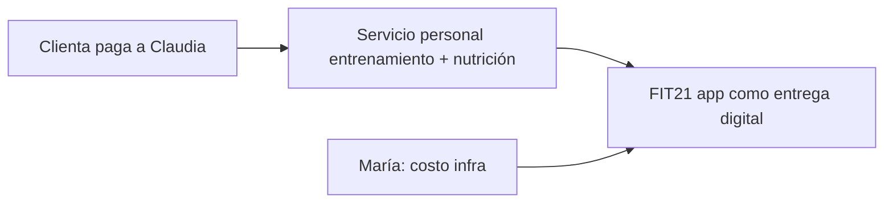

# Operación y go-to-market — FIT21

Cómo funciona FIT21 **en la vida real**: quién hace qué, en qué herramienta, cómo se atiende soporte y cómo encaja el **modelo de negocio** hoy y a futuro.

---

## 1. Resumen del modelo operativo

FIT21 es un servicio de **entrenamiento personal** donde la coach entrega planes digitales por **link personal**. La tecnología es una **PWA** (app web instalable), no una app de tienda — por ahora.

| Rol | Persona (ejemplo) | Relación con la app |
|-----|-------------------|---------------------|
| **Admin del sistema** | María | Desarrolla, despliega, seguridad, incidencias técnicas |
| **Coach (usuario operativo)** | Claudia | Única usuaria con login; gestiona clientas y planes |
| **Clienta (usuaria final)** | Wendy, Rosita, etc. | Sin login; entra por link de WhatsApp |

---

## 2. Admin del sistema (María)

María es responsable de que la **plataforma exista, esté segura y actualizada**. No gestiona rutinas de clientas en el día a día — eso es la coach.

### 2.1 Herramientas y para qué sirve cada una

| Herramienta | URL / acceso | Qué hace María aquí |
|-------------|--------------|---------------------|
| **Cursor** | IDE local | Editar código, documentación, asistencia IA para features y fixes |
| **GitHub** | [github.com/mrpl1j518-glitch/fit21](https://github.com/mrpl1j518-glitch/fit21) | Versionar código; `push` a `main` dispara deploy |
| **Vercel** | [vercel.com](https://vercel.com) → proyecto fit21 | Hosting de la app; variables de entorno; ver si el deploy terminó |
| **Firebase Console** | [console.firebase.google.com](https://console.firebase.google.com) → `fit21-eb8d4` | Auth coach, Firestore datos, rules, App Check |
| **Terminal local** | `npm test`, `npm run build`, `npm run deploy:rules` | Validar antes de publicar; desplegar reglas Firestore |

**Producción:** https://fit21-amber.vercel.app

### 2.2 Tareas recurrentes (María)

#### Cuando hay un cambio de código

1. Desarrollar en Cursor
2. `npm test` y `npm run build`
3. Commit + `git push origin main`
4. Verificar en Vercel / GitHub que el deploy sea **Ready**
5. Si cambió `firestore.rules` → `npm run deploy:rules`

#### Mensual o según necesidad

- Revisar uso/costos en Firebase Console
- Confirmar que el **registro público** en Auth sigue desactivado ([SECURITY.md](../SECURITY.md))
- Revisar que `VITE_COACH_EMAILS` y `coachEmails()` sigan alineados
- Backup mental: historial en Git + `routineHistory` / `nutritionHistory` en Firestore

#### Solo si hay incidente

- Clienta no puede marcar días → revisar rules, `cycleStartedAt`, consola del navegador
- Coach no entra → Firebase Auth, allowlist, contraseña
- App no carga → Vercel status, variables `.env` en Vercel
- iOS no instala bien → manifest `/api/manifest`, infografía Safari

### 2.3 Qué NO hace María en operación normal

- No edita rutinas de Wendy (eso es Claudia)
- No envía links a clientas (eso es Claudia)
- No decide cuándo empieza el ciclo de una clienta (eso es Claudia en el dashboard)

---

## 3. Coach (Claudia) — operación diaria

La coach es la **operadora del negocio** dentro de la app. Entra en:

**https://fit21-amber.vercel.app/coach**

Login: email + contraseña (Firebase Auth). Solo correos autorizados.

### 3.1 Flujo con una clienta nueva

| Paso | Dónde | Acción |
|------|-------|--------|
| 1 | Dashboard coach | **Registrar** clienta (nombre) |
| 2 | Editar plan | Asignar **rutina** y/o **nutrición** por día (Lun–Dom) |
| 3 | Biblioteca | Reutilizar ejercicios con GIF si aplica |
| 4 | Dashboard | Copiar **link personal** (botón “Copiar link”) |
| 5 | WhatsApp | Enviar link + mensaje de instalación (ver §6) |
| 6 | Dashboard | Cuando empiece el plan real → **Iniciar ciclo** |
| 7 | Seguimiento | Ver avance, metas, feedback, notificaciones enviadas |

### 3.2 Flujo con clienta existente

| Situación | Acción coach |
|-----------|--------------|
| Ajustar rutina del martes | Editar → guardar |
| Nueva clienta en semana 2 | Editar plan; no hace falta nuevo link si es la misma persona |
| Clienta no marca días | Dashboard: chip “Sin avance aún”; mensaje por WhatsApp |
| Terminó ciclo de 28 días | Badge “Ciclo completado” → **Reiniciar ciclo** cuando acuerden el siguiente bloque |
| Empezó antes de tiempo (error) | **Reiniciar ciclo** el día correcto (ej. lunes) |
| Motivar / avisar cambio | Notificaciones desde el flujo coach (campana clienta) |

### 3.3 Antes de “Iniciar ciclo”

La clienta puede **ver** su plan (preview), pero:

- No ve “Día X de 28”
- No puede marcar “completé mi rutina”

La coach debe pulsar **Iniciar ciclo** el día acordado (ej. lunes 13 de julio).

### 3.4 Herramientas de la coach (solo app + WhatsApp)

| Herramienta | Uso |
|-------------|-----|
| FIT21 `/coach` | Todo el trabajo de planes y seguimiento |
| WhatsApp | Entrega de link, instalación, motivación, dudas de uso |
| Biblioteca FIT21 | Catálogo de ejercicios (no hace falta Google Drive manual si ya está en biblioteca) |

La coach **no** necesita: Firebase Console, GitHub, Vercel ni Cursor.

---

## 4. Clienta — operación diaria

La clienta **no tiene cuenta**. Su “login” es el **link personal**.

**Ejemplo:** `https://fit21-amber.vercel.app/plan/wendy-h9cNgFsHl8`

### 4.1 Primera vez

1. Abrir link (ideal: pegar en **Chrome** Android o **Safari** iPhone)
2. Instalar en pantalla de inicio (ver infografía / mensaje coach)
3. Abrir desde el icono → debe verse “Hola, [nombre]”
4. Explorar días Lun–Dom; leer rutina y alimentación
5. Cuando la coach haya iniciado el ciclo → marcar **“¡Hoy completé mi rutina!”**
6. Botón **?** si tiene dudas de la interfaz

### 4.2 Cada día (con ciclo activo)

1. Abrir FIT21 (icono o link)
2. Ver rutina y comidas del día (o cambiar día en las pestañas)
3. Entrenar
4. Marcar checkbox de completado
5. Ver avance (puntos 28 + semana); celebraciones en días 1, 7, 14, 21, 28
6. Opcional: dejar **feedback** o leer **notificaciones** de la coach

### 4.3 Después del día 28

- Puede seguir viendo rutina y marcando días
- Los días **fuera** de la ventana de 28 **no suman** al contador
- La coach reiniciará el siguiente ciclo cuando corresponda

### 4.4 Qué no hace la clienta

- No edita su plan (pide cambios a la coach por WhatsApp)
- No comparte su link con otras personas
- No usa `/coach` ni la landing genérica para su día a día

---

## 5. Soporte

### 5.1 Matriz de soporte

| Tipo | Ejemplos | Quién responde | Canal |
|------|----------|----------------|-------|
| **Funcional** | “¿Cuántas repeticiones?”, “¿Puedo cambiar el martes?”, “No entiendo mi plan” | **Coach (Claudia)** | WhatsApp |
| **Uso de la app** | “¿Cómo instalo?”, “¿Dónde marco el día?”, “¿Qué es el botón ?” | **Coach** primero; infografía | WhatsApp + ayuda in-app |
| **Técnico** | App no carga, error al guardar, link roto, bug tras actualización | **María** (admin) | Coach escala por WhatsApp / email |
| **Instalación iOS/Android** | Icono abre pantalla genérica, Chrome en iPhone | **Coach** con guía; si persiste → María | Infografía + reinstalar icono |

### 5.2 Guión de soporte funcional (coach)

Preguntas frecuentes que la coach resuelve sin María:

1. **“No veo mi rutina”** → ¿La coach ya asignó ejercicios ese día? ¿Ciclo iniciado?
2. **“No puedo marcar completado”** → La coach debe pulsar **Iniciar ciclo**
3. **“Dice día 2 pero empezamos hoy”** → Coach: **Reiniciar ciclo** hoy
4. **“¿Cómo instalo?”** → Enviar mini-guía iPhone/Android (§6)
5. **“Cambié de celular”** → Reabrir el mismo link y reinstalar

### 5.3 Escalamiento técnico (coach → María)

La coach reúne antes de escalar:

- Nombre de la clienta
- Modelo de celular (iPhone / Android)
- Navegador usado (Safari, Chrome, WhatsApp in-app)
- Captura de pantalla si es posible
- ¿Link personal o pantalla genérica?

María revisa: Vercel deploy, Firebase rules, consola del navegador, datos en Firestore (`clients`, `cycleStartedAt`, `weekProgress`).

### 5.4 SLA informal (MVP)

| Severidad | Ejemplo | Objetivo |
|-----------|---------|----------|
| Alta | App caída para todas | María: mismo día |
| Media | Una clienta no puede marcar días | 24–48 h |
| Baja | Mejora de texto / UI | Backlog en GitHub |

---

## 6. Go-to-market y onboarding de clientas

### 6.1 Canal principal hoy

**WhatsApp 1-a-1** — la coach envía el link personal. No hay marketing masivo ni tienda de apps.

### 6.2 Mensaje tipo para nuevas clientas (coach)

**Bloque 1 — Link**

> Hola [nombre], aquí está tu plan FIT21 personal:
> [link]
> Ábrelo y guárdalo en tu celular como app.

**Bloque 2 — Instalación**

> 📱 **iPhone:** copia el link → pégalo en **Safari** → Compartir (↑) → **Agregar a pantalla de inicio**. (Chrome en iPhone no instala la app.)
>
> 🤖 **Android:** si no tienes Chrome, bájalo en Play Store. Copia el link → pégalo en **Chrome** → menú ⋮ → **Instalar app**.

**Bloque 3 — Ciclo**

> Puedes ver tu rutina y alimentación ya. El contador de 28 días lo activo yo el día que empezamos oficialmente.

### 6.3 Infografía

La coach puede generar una infografía con GPT usando el prompt acordado en la documentación de conversación (iPhone Safari vs Android Chrome, copiar/pegar link, instalar Chrome si falta).

### 6.4 Landing pública `/`

- Existe para quien entra sin link
- Muestra “Continuar mi plan” si el celular ya recordó una clienta
- **No** es el flujo principal de onboarding
- “Acceso coach” es discreto para Claudia

### 6.5 Go-to-market futuro (no implementado)

| Fase | Canal | Notas |
|------|-------|-------|
| Actual | WhatsApp + link | Pocas clientas, alta personalización |
| Corto plazo | Infografía + reel Instagram de Claudia | Mismo link personal tras contacto |
| Mediano | Google Play (TWA) | “Busca FIT21” + luego link personal |
| Largo | SaaS multi-coach, web de venta | Otro producto; requiere auth clienta, billing |

---

## 7. Modelo de negocio

### 7.1 Hoy (julio 2026)

| Elemento | Descripción |
|----------|-------------|
| **Cliente pagador** | La clienta (o su empresa) paga a **Claudia / FIT21** por el servicio de coaching |
| **Producto** | Acompañamiento + plan personalizado; la **app es el medio de entrega** |
| **Precio** | Lo define Claudia fuera de la app (transferencia, efectivo, etc.) |
| **FIT21 app** | Incluida en el servicio; no hay cobro in-app |
| **Costos tech** | Firebase (free/low), Vercel (hobby/pro), dominio si aplica, tiempo María |

La app **no cobra** ni procesa pagos hoy.

### 7.2 Propuesta de valor

**Para la clienta:** rutina y alimentación siempre a la mano, avance visible, constancia gamificada (28 días).

**Para la coach:** un solo lugar para planes, menos PDFs/WhatsApp repetitivos, vista de avance por clienta, biblioteca de ejercicios.

**Para María (como proyecto):** base escalable hacia SaaS o Play Store sin reescribir desde cero.

### 7.3 Evolución del negocio (hipótesis)

| Etapa | Clientas | Ingreso | Tecnología |
|-------|----------|---------|------------|
| **Ahora** | Pocas, conocidas | Coaching 1-a-1 | PWA + WhatsApp |
| **6 meses** | Decenas | Mismo + posible grupo | Play Store + infografía |
| **12+ meses** | Otras coaches | Suscripción B2B (SaaS) | Multi-tenant, billing |

### 7.4 Roles en el negocio vs roles en la app

| Negocio | App |
|---------|-----|
| Claudia vende y acompaña | Claudia = usuario `coach` |
| María construye y opera la plataforma | María = admin (sin rol en la UI) |
| Clienta consume el servicio | Clienta = usuario anónimo por link |

---

## 8. Mapa de cuentas y accesos

| Servicio | Titular sugerido | Quién usa |
|----------|------------------|-----------|
| GitHub `fit21` | María | María |
| Vercel proyecto | María | María |
| Firebase `fit21-eb8d4` | María | María (ops); Claudia solo vía app |
| Firebase Auth coach | María crea usuario | Claudia |
| WhatsApp Business (si aplica) | Claudia | Claudia |
| Dominio `fit21-amber.vercel.app` | Vercel/María | Todos (público) |

**Importante:** las credenciales de coach y las API keys **no** se comparten con clientas.

---

## 9. Checklist operativo semanal (coach)

- [ ] Revisar dashboard: ¿ciclos por iniciar o reiniciar?
- [ ] Responder feedback de clientas
- [ ] Enviar notificación si hay cambio importante en el plan
- [ ] Seguimiento WhatsApp a quien lleva varios días sin marcar

## 10. Checklist operativo mensual (María)

- [ ] Deploy y tests OK
- [ ] Firebase: revisar Auth y rules
- [ ] Vercel: variables de entorno vigentes
- [ ] Costos Firebase/Vercel dentro de lo esperado
- [ ] Documentación actualizada si hubo cambios grandes

---

## 11. Documentos relacionados

- [DISCOVERY.md](./DISCOVERY.md) — qué se construyó y por qué
- [ARCHITECTURE.md](./ARCHITECTURE.md) — cómo está hecho técnicamente
- [CODE_GUIDE.md](./CODE_GUIDE.md) — para desarrollo
- [SECURITY.md](../SECURITY.md) — seguridad en producción
