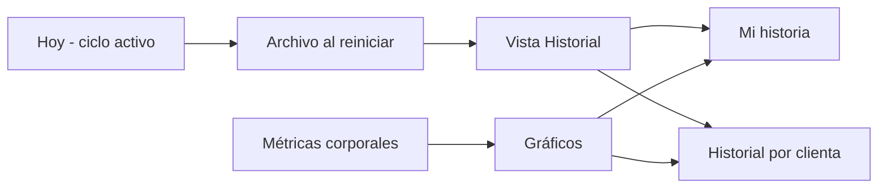
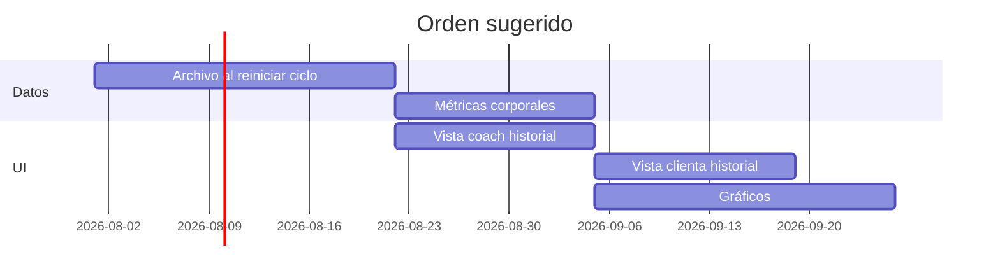

# Roadmap — FIT21

Backlog de producto y evolución técnica. El MVP actual cubre el **ciclo activo**; este documento describe la siguiente ola de valor: **historia, métricas y gráficos** para clienta y coach.

**Estado:** planificado (no implementado)  
**Última actualización:** julio 2026

---

## Visión

Que cada clienta pueda ver **su trayectoria** (no solo el plan de hoy) y que la coach tenga la **misma historia por clienta** para acompañar mejor y retener el servicio.



---

## Épica R1 — Historial de ciclos

### Historias

| ID | Como… | Quiero… | Para… |
|----|--------|---------|-------|
| R1-H1 | clienta | ver una lista de mis ciclos anteriores (fechas, días completados) | recordar mi constancia |
| R1-H2 | clienta | abrir un ciclo pasado y ver rutina/nutrición de entonces (solo lectura) | comparar cómo entrenaba antes |
| R1-H3 | coach | ver el historial de ciclos de cada clienta en su ficha | evaluar progreso entre bloques de 28 días |
| R1-H4 | coach | que al **Reiniciar ciclo** se archive automáticamente el ciclo que termina | no perder datos al empezar uno nuevo |

### Base existente en el código

- `routineHistory` / `nutritionHistory` — snapshot en cada guardado del coach (sin UI)
- `weekProgress`, `progressCount`, `cycleStartedAt` — datos del ciclo actual
- `restartClientCycle()` — punto natural para disparar el archivo

### Modelo de datos propuesto

```
cycleArchives/{clientId}_{archiveId}
  clientId: string
  cycleNumber: number          // 1, 2, 3…
  startedAt: string            // ISO
  endedAt: string              // ISO (momento del reinicio)
  progressCount: number        // 0–28 al cierre
  weekProgressSnapshot: Record<string, boolean>
  coachMeta?: { routineGoal, nutritionGoal, calories }
  routinesSnapshot: Routine[]  // 7 días, o refs a routineHistory ids
  nutritionSnapshot: NutritionPlan[]
```

### UI propuesta

**Clienta** — nueva pestaña o sección **「Historial」**:

- Tarjetas: “Ciclo 2 · mar–abr 2026 · 22/28 días”
- Detalle: mini-grilla 28 días + enlace a rutina por día

**Coach** — en `ClientOverviewPanel` o tab **「Historial」**:

- Misma lista + comparación rápida último vs anterior

### Criterios de aceptación

- [ ] Reiniciar ciclo crea un documento en `cycleArchives` sin borrar el archivo anterior
- [ ] Clienta ve solo sus propios archivos (rules: `clientId` en path + get público con link)
- [ ] Coach ve archivos de todas sus clientas
- [ ] Rutina archivada es **solo lectura**

### Esfuerzo estimado

Medio — 1–2 semanas de desarrollo + rules + pruebas.

---

## Épica R2 — Métricas corporales (peso, tallas)

### Historias

| ID | Como… | Quiero… | Para… |
|----|--------|---------|-------|
| R2-H1 | clienta | registrar mi peso (y opcionalmente medidas) con fecha | ver mi evolución física |
| R2-H2 | coach | registrar o corregir métricas de una clienta | centralizar datos que hoy van en WhatsApp/notas |
| R2-H3 | clienta | ver una tabla o lista de mis registros pasados | no depender de memoria o capturas |

### Modelo de datos propuesto

```
bodyMetrics/{clientId}/entries/{entryId}
  date: string                // YYYY-MM-DD
  weightKg?: number
  waistCm?: number
  hipsCm?: number
  chestCm?: number
  armCm?: number
  note?: string
  recordedBy: 'client' | 'coach'
  createdAt: string
```

### Reglas (borrador)

- Clienta: `create`/`update` solo sus entradas, campos acotados
- Coach: CRUD en entradas de sus clientas
- Validación: peso/medidas en rangos razonables en rules o cliente

### UI propuesta

**Clienta** — sección **「Mis datos」**:

- Formulario simple: fecha, peso, cintura (expandible)
- Lista cronológica

**Coach** — en ficha clienta **「Métricas」**:

- Mismos datos + botón agregar en nombre de la clienta

### Esfuerzo estimado

Medio — 1 semana + iteración UX con Claudia.

---

## Épica R3 — Gráficos de progreso

### Historias

| ID | Como… | Quiero… | Para… |
|----|--------|---------|-------|
| R3-H1 | clienta | ver un gráfico de peso en el tiempo | visualizar tendencia |
| R3-H2 | clienta | ver gráfico de días completados por ciclo | entender mi constancia |
| R3-H3 | coach | comparar dos ciclos de la misma clienta (lado a lado) | ajustar el siguiente plan |
| R3-H4 | clienta | recibir un mensaje tipo “tu mejor ciclo fue…” | motivación |

### Enfoque técnico

- **Sin backend nuevo:** gráficos en cliente con datos de Firestore (SVG o librería liviana, ej. recharts — evaluar peso del bundle PWA)
- Reutilizar estética de `DayPips`, `CoachProgressChart`, colores FIT21
- Agregados pesados → diferir a Cloud Function solo si hace falta

### Gráficos candidatos

| Gráfico | Fuente de datos |
|---------|-----------------|
| Línea peso vs tiempo | `bodyMetrics` |
| Barras días completados por ciclo | `cycleArchives` |
| Heatmap 28 días (histórico) | `weekProgressSnapshot` archivado |
| Racha más larga | cálculo sobre `weekProgress` |

### Esfuerzo estimado

Medio-alto — 1–2 semanas según cantidad de gráficos y pulido móvil.

---

## Épica R4 — Pulido y retención (futuro)

| ID | Feature | Notas |
|----|---------|-------|
| R4-H1 | Export PDF “Mi resumen de ciclo” | Para clienta o coach |
| R4-H2 | Fotos de progreso | Firebase Storage + rules; privacidad |
| R4-H3 | Notas de coach por ciclo | Texto libre en `cycleArchives` |
| R4-H4 | Insights automáticos | “+3 kg perdidos desde ciclo 1”, reglas simples |
| R4-H5 | Notificación “Nuevo ciclo archivado” | Opcional |

---

## Prioridad recomendada



1. **R1** — Archivo de ciclos + vista coach (Claudia lo necesita primero)
2. **R2** — Métricas corporales
3. **R3** — Gráficos
4. **R4** — PDF, fotos, insights

---

## Dependencias y riesgos

| Tema | Nota |
|------|------|
| **Costos Firestore** | Más documentos por clienta; monitorear con 50+ clientas activas |
| **Privacidad** | Peso/fotos = datos sensibles; política de privacidad obligatoria antes de escalar |
| **PWA bundle** | Librerías de gráficos pueden aumentar peso; preferir SVG custom al inicio |
| **iOS/Android** | Sin cambios de instalación; solo nuevas pantallas en la misma app |
| **Historial actual** | `routineHistory` hoy es por guardado, no por ciclo; R1 unifica el modelo |

---

## Relación con el negocio

| Beneficio | Para quién |
|-----------|------------|
| Retención entre ciclos de 28 días | Clienta ve progreso acumulado |
| Justificación del cobro por bloque | Coach muestra evolución en datos |
| Diferenciación vs PDF/WhatsApp | Historia viva en la app |
| Base para SaaS multi-coach | Cada organización con historial por clienta |

---

## Documentos relacionados

- [DISCOVERY.md](./DISCOVERY.md) — MVP entregado
- [ARCHITECTURE.md](./ARCHITECTURE.md) — stack actual
- [OPERATIONS.md](./OPERATIONS.md) — quién opera qué hoy
- [CODE_GUIDE.md](./CODE_GUIDE.md) — dónde tocar código cuando se implemente R1

---

## Cuándo retomar

Señales para priorizar este roadmap:

- [ ] 5+ clientas con al menos 2 ciclos completados
- [ ] Coach pide “¿cómo le fue el ciclo pasado?” con frecuencia
- [ ] Clientas preguntan por peso/medidas en la app
- [ ] Política de privacidad publicada (requisito si hay métricas corporales)
